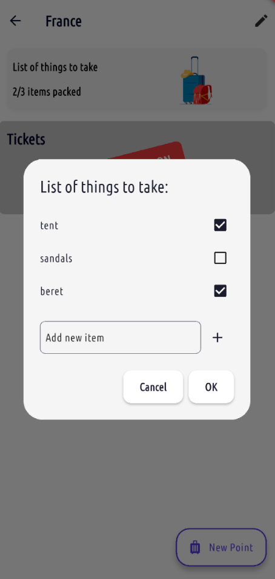
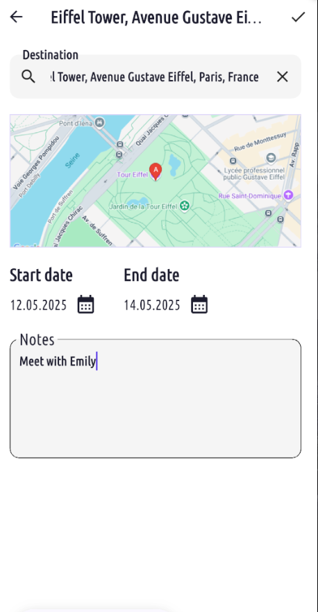
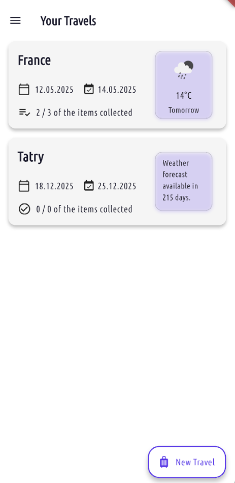
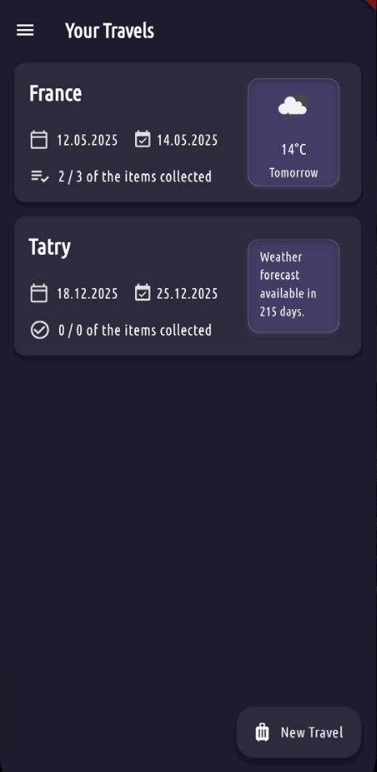
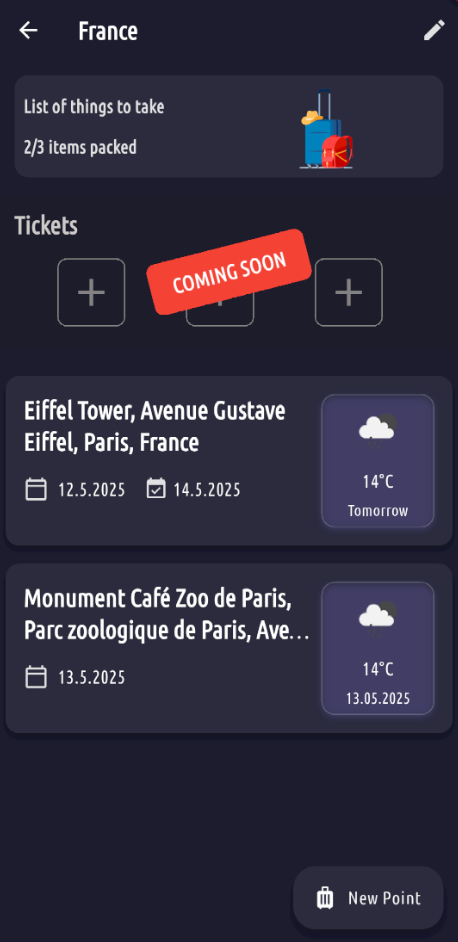

# Trip Organizer

A comprehensive mobile application for planning and organizing your travels, built with Flutter.

## 🚧 Project Status: Under Development 🚧

This project is currently under active development. The basic functions are so far adapted to Android. In the future, the application will also be running on IOs.

## Overview

Trip Organizer is designed to help travelers plan, organize, and manage their journeys efficiently. Whether you're planning a weekend getaway or a long-term adventure, our app provides the tools you need to make your travel planning seamless.

### Planned Features

- **Trip Planning**: Create and manage multiple trip itineraries
- **Location Management**: Save and organize places you want to visit
- **Interactive Maps**: Visualize your travel routes and points of interest
- **Travel Checklist**: Keep track of essential items and tasks
- **Dark/Light Theme**: Comfortable viewing experience in any lighting condition

## Technology Stack

- Flutter/Dart
- Google Maps Integration
- Riverpod 
- Firebase for Authentication and Cloud Firestore
- HTTP Package for Network Requests
- Integration with External APIs (e.g., OpenWeather for weather updates)

## Screenshots

